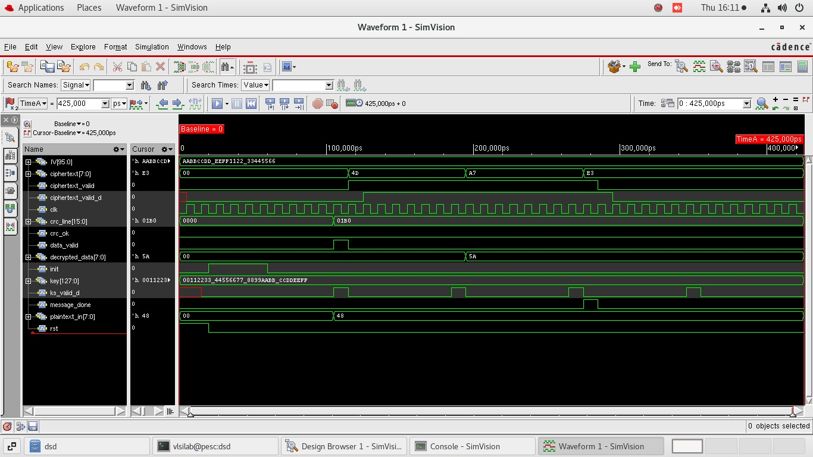
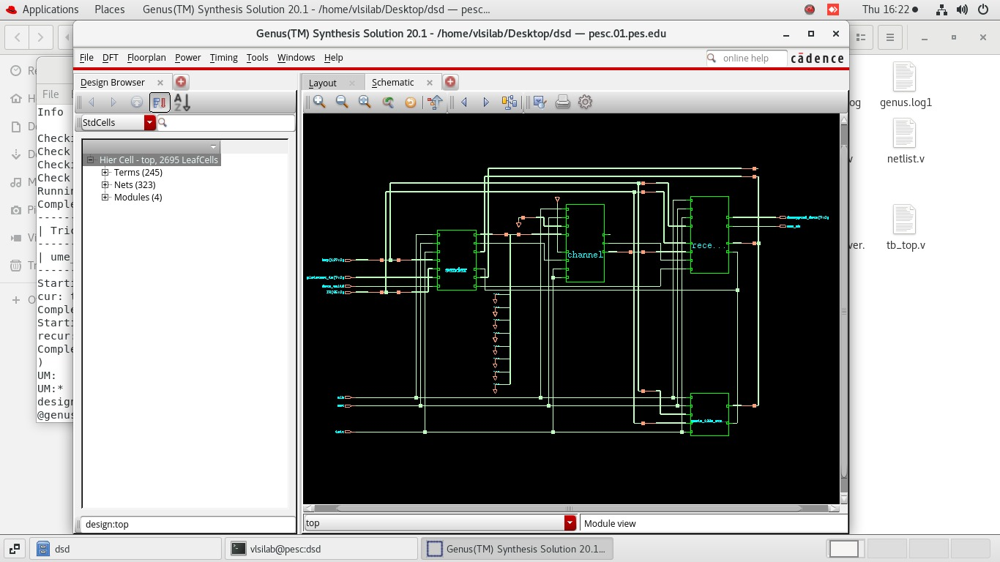
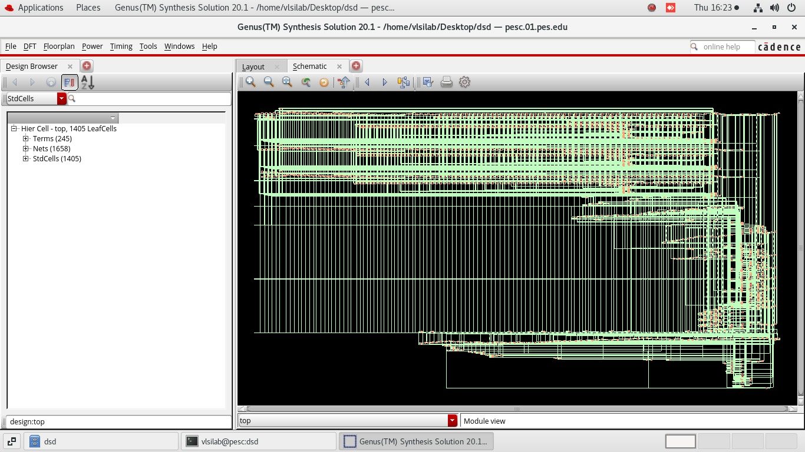

# Grain-128A Stream Cipher | Verilog RTL

A hardware implementation of the **Grain-128A lightweight stream cipher** with CRC-based error detection, designed as a complete sender–channel–receiver communication system.

## Overview

The project combines lightweight stream-cipher encryption with transmission error detection in a modular Verilog RTL design.

The communication flow is:

**Plaintext → Encryption → CRC → Channel → Error Injection → Receiver → CRC Verification**

The design was verified through RTL simulation and waveform analysis, followed by logic synthesis and post-synthesis evaluation.

## Architecture

The system consists of three primary stages:

- **Sender** — generates the Grain-128A keystream, encrypts the input data, and incorporates CRC information for transmission.
- **Channel** — models the communication path and supports transmission error injection.
- **Receiver** — processes the received data, performs CRC verification, and recovers the transmitted information.

## Implementation

The RTL is organized into modular Verilog components:

| Module | Description |
|---|---|
| `grain_128a_stream_cipher.v` | Grain-128A keystream generation |
| `sender.v` | Sender-side encryption and CRC handling |
| `channel.v` | Communication channel and error injection |
| `receiver.v` | Receiver-side processing and CRC verification |
| `top.v` | System-level integration |

## Verification

Dedicated testbenches are included for individual modules as well as the integrated system.

Verification covers:

- Grain-128A cipher operation
- Sender and receiver functionality
- Channel error injection
- CRC-based error detection
- End-to-end system behavior

### RTL Simulation

## Synthesis & Analysis

The RTL design was synthesized using **Cadence Genus** and evaluated for:

- Area
- Power
- Timing
- Gate-level implementation

### Synthesis Schematic

### Gate-Level Netlist

Detailed synthesis reports are available in the `reports/` directory:

- `area1.rpt`
- `power1.rpt`
- `timing1.rpt`

## Repository Structure

- `src/` — RTL design modules
- `testbench/` — Verilog testbenches
- `docs/` — Simulation and synthesis visualizations
- `reports/` — Synthesis reports

## Tools

**Verilog HDL · Icarus Verilog · GTKWave · Cadence Genus**

## Focus

**Hardware Cryptography · RTL Design · Digital VLSI · Functional Verification · Logic Synthesis**